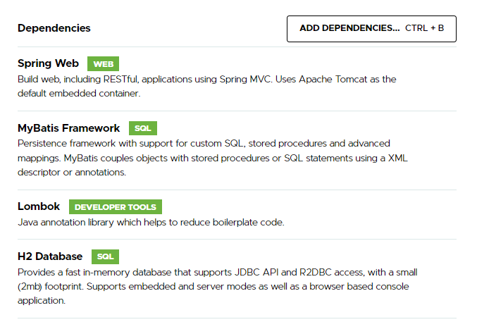

# SpringBoot + MyBatis 샘플

## Mybatis
* 객체 지향 언어인 자바의 관계형 데이터베이스 프로그래밍을 보다 쉽게 도와주는 프레임워크
* 자바 Object 와 SQL 사이에 매핑기능을 제공한다.

## Mybatis 특징

* SQL 파일을 별도의 파일로 분리해서 관리하고, 
* Mapper 파일에 SQL 코드만 변경하면 된다.

---

## SpringBoot-MyBatis 설정하기

* Gradle 의존성 추가하기

    dependencies {
        implementation 'org.springframework.boot:spring-boot-starter-web'
        implementation 'org.mybatis.spring.boot:mybatis-spring-boot-starter:2.2.2'
        compileOnly 'org.projectlombok:lombok'
        runtimeOnly 'com.h2database:h2'
        annotationProcessor 'org.projectlombok:lombok'
        testImplementation 'org.springframework.boot:spring-boot-starter-test'
    }

* 데이터베이스 연결정보 추가(application.yml)

    
    #DB 연결 정보
    spring:
        datasource:
            driver-class-name: org.h2.Driver
            url: jdbc:h2:tcp://localhost/~/test
            username: sa

## DB 연결 테스트
ConnectionTest 를 추가한다.

~~~
@SpringBootTest
public class ConnectionTest {
    @Autowired
    SqlSessionFactory sqlSessionFactory;

    @Test
    public void DBConnection() {
        try {
            Connection con = sqlSessionFactory.openSession().getConnection();
            System.out.println("DB Connection Success");
        } catch (Exception e) {
            e.printStackTrace();
            fail();
        }
    }
}
~~~